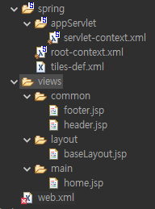

### 화면<=>컨트롤럴  class <=> 서비스 interface <=> 다오 interface

​     interface는 구현구가 핑요함 :                     service imp(class)                                   mapper(xml) 

​                                                                                                                    src>main>resources> mappers                                                                  

​           vo(class)                                       vo(class)                                         vo(class)

 

//DAO : data access object 

//vo : value object 

http://www.tomonari.co.kr/#a

"browser setting: window > preferences > web browser > use external > chrome"

server 항목을 볼 수 있게 (1server에 1 project)**  *localhost:8080/test1*

eclipse에서 project만들때 ctrl+N > spring > spring legacy project > spring MVC project 

1. window > showView > other > server > open 
2. ctrl + N  server Apache Tomcat 9 
3. package  선택 right click -> run as -> run on server -> localhost 선택후 server한개 선택


**한글인코딩** *내숭이 블로그 복붙을 위해*  *https://stajun.tistory.com/*

1.web.xml 파일수정 
 src > main > webapp > web-inf> web.xml 
</web-app>위에 복붙  

2.STS 인코딩 설정
Window > preferences > workspace > text file encoding > UTF-8 

3.jsp 파일 인코딩 설정

src > main > webapp > web-inf> views > home.jsp
<%@ page session="false" %> 지우고 복붙 

<!DOCTYPE html> 추가 


**Tiles 연동** *템플릿 설정하기* 

1. 타일즈 의존성 추가 (pom.xml) : 젤 밑 target 밑에
   - 5.1.8. version 

- 15번째 줄 <org.apache.tiles-version>3.0.8</org.apache.tiles-version> 복붙


   - pom.xml 파일 안 `<dependencies>` 태그 안에 의존성 추가 : </dependencies> 앞에 복붙\


**View Resolver 등록 (servlet-context.xml)**  

spring_ashutest > src/main/java > kr.green.test1.controller로 이름 바꿔줌 

src > main > webapp > web-inf > spring > appServlet > 

젤 밑 base-package 부분  "kr.green.test1.controller"를  "kr.green.test1.*" 로 바꿈 

servlet-context.xml에 다음 코드를 추가 복붙 

   ​

3. **타일즈 설정 추가** 

WEB-INF > spring 폴더에 tiles-def.xml 파일 생성 후 다음 코드 붙여넣기

: 1번들은 지워줌 


4. **기본 레이아웃 설정** 

   

- *baselayout* 

<html>위에 <!DOCTYPE html> 복붙 

빨간줄 지워줌  & container 지움 

타이틀 밑에 복붙 (head다운로드받은거)

<link rel="stylesheet" href="https://maxcdn.bootstrapcdn.com/bootstrap/4.3.1/css/bootstrap.min.css">
<script src="https://ajax.googleapis.com/ajax/libs/jquery/3.4.1/jquery.min.js"></script>
<script src="https://cdnjs.cloudflare.com/ajax/libs/popper.js/1.14.7/umd/popper.min.js"></script>
<script src="https://maxcdn.bootstrapcdn.com/bootstrap/4.3.1/js/bootstrap.min.js"></script>

첨부파일 (footer, header, head) 다운로드 받아 복붙 

- <h1>헤더</h1>


- window > preferences > en 타입후  > css file/html/jsp > Korean > UTF-8


**controller로 가서** 

return "/main/home"; 수정해줌 

/main/home 으로 접속 하여 테스트 한 후, value = "/"로 바꾸어줌 


### 각종 패키지 생성 

- Service package


- Dao package


- VO package 

  ​

# **DB연동하기** 

**의존성 추가하기**

- MyBatis 연동에 필요한 의존성을 pom.xml에서 dependencies 태그 안에 추가 후 저장

**MyBatis 관련 정보 설정하기** 

- spring>appServlet > root-context.xml 에서  source 옆 Namespaces 로 감 

​       : aop, beans, context, jdbc, mybatis 5항목 체크 

- 예시복사 후 </beans>위에 붙여넣기 한 후 수정 

         value="jdbc:mysql://localhost:3306/community?useSSL=false&amp;serverTimezone=Asia/Seoul">
    </property>
    <property name="username" value="root"></property>
    <property name="password" value="cjgreen"></property>
    </bean> 


## DB연동 테스트

- src/main/resources에서 mappers 폴더 생성 

  MemberMapper.xml 파일 생성 후 MyBatis 연동 확인하기 밑 코드 복 붙 후 

  <mybatis-spring:scan base-package="kr.green.test1.dao"/>

  이름 바꾸고 <select> email 부분 지워주기 


- controller 위에 ctrl + N  후 package 선택 후 controller 지우고 dao

   & service & vo 붙여 3개의 패키지 생성 


- sevice 패키지 선택 후 ctrl + N 후 interface 타입 후 MemberService 생성 


- sevice 패키지 선택 후 ctrl + N 후 class 에서 MemberServiceImp 생성 후 

  public class MemberServiceImp implements MemberService{

- dao 패키지 선택 후 ctrl + N 후 interface 타입 후 MemberDAO 생성 

  ​


**VO class 만들기** : *비닐봉투와 같은 역할* 

- vo 패키지(.vo) 먼저 만든 후,  class 이름 맨 뒤에 VO를 붙여 만든다 


- table을 보고 객체 만듬 private String me_id; 등등


- getter/ setter &@toString 생성 


- login.jsp : name 에 맞는 객체 이름으로 넣어주고 


컨트롤러에 멤버변수로 MemberService 추가 @Autowired 이용 

서비스임프에 @Autowired

​                           MemberDAO memberDao; 

​                        & @Service 추

**서버를 재가동하여 에러가 안나는지 테스트** 


### 컨트롤러/서비스/다오/메퍼에 샘플 코드 추가 및 테스트 

DB에 샘플 데이트 추가 

- 컨트롤러 샘플 코드


- ```
  @RequestMapping(value= "/")
  public ModelAndView openTilesView(ModelAndView mv) throws Exception{
      mv.setViewName("/main/home");
      //아래 코드는 연동 확인후 지울 코드
      //qwe는 샘플 데이터에 있는 회원아이디
      MemberVO user = memberService.test("qwe");
      System.out.println(user);
      return mv;
  }
  ```


- 서비스 샘플 코드

  - ```
    MemberVO test(String id);
    ```

- 서비스임플 샘플 코드

  - ```
    @Override
    public MemberVO test(String id) {
        return memberDao.test(id);
    }
    ```

- 다오 샘플 코드

  - ```
    MemberVO test(@Param("id")String id);
    ```

- 매퍼 샘플 코드

  - ```
      <select id="test" resultType="kr.green.green.vo.MemberVO">
      	select * from member where me_id = #{id}
      </select>
      ```
    ```

    ```


### 8. 회원가입 기능 구현(비밀번호 암호화 적용)

- [github.com/st8324/Docs](https://github.com/stajun2/java_jik/blob/main/5.SPRING/github.com/st8324/Docs) 참고

  header.jsp 회원가입 링크 추가 

  컨트롤러에서 회원가입 화면을 보여줄수 있는 메소드를 추가 

  - /signup에 GET방식
  - 보여줄 화면은 /member/signup.jsp로 설정 

  회원가입 화면파일을 생성

  -  회원가입 화면을 구성

  컨트롤러에 회원가입을 처리하는 메소드를 추가 

  - /signup에 POST방식
  - 일을 다 처리한 후, 메인페이지(/)로 이동을 시킴 
  - 회원가입이 정상적으로 진행되지 않으면 회원가입페이지(/signup)으로 이동

  컨트롤러에 화면에서 전달한 회원정보를 받아서 확인 

  - 매개변수를 추가 (ModelAndView mv, MemberVO user)

    그리고 확인 System.out.println(user);

  - 생일과 관련해서 에러가 발생할 수 있음

    - 원인 : 화면에서는 yyyy-mm-dd로 된 문자열을 전송하는데 생일이 Date클래스로 되어 있으면 자동으로 변환이 안됨. String이 Date로 형변환이 안됨.

    - 해결방안 : setMe_birth(String date)로 setter를 수정하여 문자열로 된 날짜를 Date로 변환하는 코드를 작성해야 함

    - ```
      public void setMe_birth(String me_birth) {
          SimpleDateFormat format;
          try {
              format = new SimpleDateFormat("yyyy-MM-dd");
              this.me_birth = format.parse(me_birth);
          } catch (ParseException e) {
              e.printStackTrace();
          }
      }
      ```

  - 화면에 input tag/textarea tag/select tag 등에 name을 MEmverVO의

    매개변수와 같게 설정 

  컨트롤러에서 회원정보를 서비스에게 주면서 회원가입하라고 시킴 

  -  이때 서비스는 회원가입 진행 후 가입이 성공했는지 아닌지 컨트롤러에게 

    알려줌(리턴타입)

  서비스에 회원가입 메소드 추가 

  - 컨트롤러에서 에러나는 부분 마이스 호버 create method...

  서비스 임플에 회원가입 기능을 구현 

  - 비밀번호 암호화을 함 
  - 다오에게 회원가입 정보를 전달하면서 가입하라고 시킴 

  다오에 회원가입 메소드 추가 

  - 서비스임플에서 에러나는 부분 호버 후 create method...
  - @Param("이름")을 매개변수 앞에 추가 

  매퍼에 쿼리문 구현 

  - id에 다오에 추가한 메소드명을 입력

  - 쿼리문 구현

    매개변수로 넘어오는 값은 #{}를 이용하고, 넘겨주는 값이 정수나 문자열이 아니면 #{객체명.멤버변수명}으로 호출

    ​

#### 로그인 기능 구현(Interceptor를 이용하여 로그인 유지 적용)

https://github.com/st8324/Docs/blob/master/spring%20framework/Interceptor%EB%A5%BC%20%EC%9D%B4%EC%9A%A9%ED%95%9C%20%EC%9C%A0%EC%A0%80%20%EC%A0%95%EB%B3%B4%20%EC%84%B8%EC%85%98%EC%97%90%20%EC%A0%80%EC%9E%A5%ED%95%98%EA%B8%B0.md

* servlet-context 

    <mapping path="/login"/>

header.jsp에 링크 추가 

컨트롤러에서 메소드 추가 및 구현 

로그인 화면 구성 : form tag & name 설정

로그인 시도시 컨트롤러에서 회원정보가 잘 오는지 확인

서비스와 서비스 임플에 코드를 구현 : 비밀번호를 확인 

다오에 메소드 추가 

매퍼에 쿼리문 추가 : resultType 설정 시 오타 조심 

문서 참고하여 로그인 유지 

로그인 시 화면에서 로그인 메뉴와 회원가입 메뉴 안보이게 처리

로그인 시 화면에서 로그아웃 메뉴 보이도록 처리 


10. 로그아웃 기능 구현 

  로그아웃 링크 추가 

  컨트롤러에 로그아웃 코드 구현 

  ​

11. ##### 인터셉터를 이용하여 회원만 게시글 등록/수정/삭제가 되도록 처리

- github.com/st8324/Docs
- 다음 URL에 대해 회원만 접근하도록 인터셉터를 생성 후 처리(MemberInterceptor)
  - /board/register
  - /board/modify
  - /board/delete

12. ##### 인터셉터를 이용하여 비회원만 로그인/회원가입이 되도록 처리

- 다음 URL에 대해 로그인 하지않은 비회원만 접근하도록 인터셉터를 생성 후 처리(GuestInterceptor)
  - /login
  - /signup 

13. #### 게시글 리스트 확인 구현 

- URL:/board/list

- 게시글 링크 등록

  header.jsp에서  <c:if>  안에 넣으면 안됨 회원과 비회원 다 볼 수 있기 때문에   

  	<li class="nav-item">
  	        	<a class="nav-link" href="<%=request.getContextPath()%>/board/list">게시글</a>
  	      	</li>

- **컨트롤러,서비스,서비스임플,다오,매퍼 만들고** 

  @Controller 추가 

  imp @Service 추가 

  mapper에서 멤버매퍼 복붙 후 보드매퍼로 한 후 코드 지우고 

  <mapper namespace="spring.green.green.dao.BoardDAO">

- **연결부분** 

  - Autowired를 이용하여 멤버변수 설정 
    - 컨트롤러에 멤버변수로 서비스를 설정
    - 서비스임플에 멤버변수로 다오를 설정 


  - 컨트롤러에 게시글 리스트 확인하는 메소드 등록 및 구현 

    List<BoardVO> list; 한 후 보드VO 클래스 만들고 

    서비스에게 일을 시킨다 

    List<BoardVO> list; boardService.getBoardList();  create 클릭 저장 하고

    확인 후 주석처리 

    System.out.println(list);

  - 서비스와 서비스 임플에 게시글 가져오는 메소드 등록 및 구현 

  - 다오와 매퍼에 게시글 가져오는 메소드 등록 및 쿼리문 작성 


- 확인 


#### 14.게시글 상세확인 

- /board/detail 

- 게시글 리스트에서 게시글 제목 링크를 수정 

- 컨트롤러에서 해당 메소드 처리하는 코드 등록 및 구현

- 서비스/서비스 임플에서 메소드 등록 및 구현 

- 다오/매퍼에서 메소드 등록 및 구현 

- 게시글 상세 화면 구현 

  ​

### 에러가 나는 경우


"오타후 수정하고나서도 작동에 안되면, 다시 이름을 바꿔서 (baseLayout F2 & tiles-def.xml)

 작동해 본 후 작동이 되면 다시 원위치로! 특히, baseLayout.jsp와 관련하여 나는 에러" 


1. 에러 내용에 다음이 들어간 경우

   - ```
     Error creating bean with name 'homeController': Unsatisfied dependency expressed through field 'memberService';
     ```

   - 경우1 : MemberServiceImp에 @Service를 빼먹은 경우

   - 경우2 : servlet-context.xml에 base-package를 잘못 설정한 경우

2. 에러 내용에 다음이 들어간 경우

   - ```
     Error creating bean with name 'memberServiceImp': Unsatisfied dependency expressed through field 'memberDao'
     ```

   - 경우1 : root-context.xml에 mybatis-spring:scan base-package를 잘못 설정한 경우

   - 경우2 : MemberDAO를 클래스로 만든 경우

3. 에러 내용에 다음이 들어간 경우

   - ```
     Invalid bound statement (not found): kr.green.green.dao.MemberDAO.test
     ```

   - 경우1 : MemberMapper.xml에 namespace에 오타가 있는 경우

   - 경우2 : MemberMapper.xml에 id에 오타가 있는 경우

   - 경우3 : mappers 폴더의 위치가 잘못된 경우

4. 에러 내용에 다음이 들어간 경우

   - ```
     Could not resolve type alias 'kr.green.green.vo.MemberVO2'.  Cause: java.lang.ClassNotFoundException: Cannot find class: kr.green.green.vo.MemberVO2
     ```

   - 경우 : MemberMapper.xml에 resultType에 오타가 있는 경우

5. xml 파일과 관련된 에러 발생후 올바르게 수정했는데 계속 에러나는 경우

   - 원인 : 수정된 내용이 반영이 제대로 안되서
   - 해결방안 : 프로젝트 선택 후 Alt + F5를 누름

6. 에러 내용에 다음이 들어간 경우

   - ```
     Could not resolve resource location pattern [classpath:mappers/**/*Mapper.xml]: class path resource [mappers/] cannot be resolved to URL because it does not exist
     ```

   - 경우 : mappers 폴더 위치가 src/main/resources가 아니거나 폴더이름에 오타가 있는 경우

7. 404 에러 중 콘솔 창에 다음 경고가 뜨는 경우

   - ```
     WARN : org.springframework.web.servlet.PageNotFound - No mapping for GET /green/login
     ```

   - 경우1 : 컨트롤러에 URL을 담당하는 메소드를 만들지 않은 경우

   - 경우2 : 새 컨트롤러에 메소드를 제대로 만들었지만 컨트롤러 위에 @Controller를 안한 경우

8. 405 에러 중 콘솔 창에 다음 경고가 뜨는 경우

   - ```
     Request method 'POST' not supported
     ```

   - 경우 : 컨트롤러에 URL 중 POST를 담당하는 메소드를 만들지 않은 경우


controller 에서 loginGet을 되는지 안되는지 확인 

- controller: 복붙후 GET을 POST로 바꿔주고 


- @RequestMapping(value = "/login", method = RequestMethod.POST)

  public ModelAndView loginPost(ModelAndView mv, MemberVO user) {
  	System.out.println(user);
  	mv.setViewName("/member/login");
  	return mv;
  }
  "데이터를 전송하면 반드시 sysout으로 콘솔에서 확인" 

sysout 지우고


#### dao와 mapper.xml 맞춰줘야 함

public interface MemberDAO {

	MemberVO getMember(@Param("me_id")String me_id);
}

<mapper namespace="kr.green.test1.dao.MemberDAO">

	<select id="getMember" resultType="kr.green.test1.vo.MemberVO">
	select*from member where me_id = #{me_id}
	</select>
</mapper>

확인위해 MemberServiceImp로 가서 sysout

MemberVO dbUser = memberDao.getMember(user.getMe_id());

	System.out.println(dbUser);
	return null;


- views>member폴더 생성후 login.jsp 생성 


- views> layout> baseLayout.jps 에 <title> 밑에 bootstrap 4줄 복붙 


"ctrl+ space는 자동 완성 코드"   

"tiles 에서 에러가 날경우 페이지 거의 밑 쪽으로 가서 확인함"


